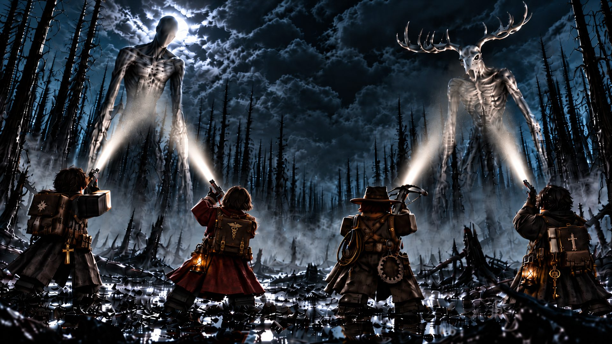

# Built with Claude 🛠️

> **Just a guy trying to make a dream.**

🌐 **[Visit the site →](https://corporalv1.github.io/built-with-claude/)**

I'm not a developer. I never was. I just had a bunch of ideas stuck in my head and no way to get them out, because I was never going to hand copy thousands of lines of code from tutorials into folders. Way too much work. Then I found Claude, and now me and it design, build, test, and ship real apps.

## 📱 What I've built so far

My working repos are private while the projects are in development, but here's what's in them:

| Project | Stack | Status |
| --- | --- | --- |
| **[DrawWatch](https://play.google.com/store/apps/details?id=com.numcheck.app)**: automatic lottery draw checker with ticket scanning, group pools, and win notifications | Flutter / Dart | 🟢 [Live on Google Play](https://play.google.com/store/apps/details?id=com.numcheck.app) |
| A home inspection app, built to make inspections faster and better documented | Flutter / Dart | 🔨 In development |
| **[WHAT WE KEEP OUT](https://corporalv1.github.io/built-with-claude/what-we-keep-out.html)** (formerly BANISHED): a 4v1 asymmetric monster hunt on Roblox. Four armed hunters track one player-controlled monster that eats to evolve | Roblox / Luau | 🟠 [Closed playtest](https://corporalv1.github.io/built-with-claude/what-we-keep-out.html) (most active) |
| A life visualizer, your whole life at a glance, week by week | Flutter / Dart | 🔨 In development |
| Smaller experiments while I figure out what people actually want | Dart / TypeScript | 🧪 Ongoing |

## 👹 Spotlight: WHAT WE KEEP OUT

My biggest project. Four hunters, one monster that eats to grow, and by the end of the match the hunted becomes the hunter. Built under my studio, Red Chevron Studios, starting 3 July 2026. It was called BANISHED until 28 September 2026.

- **Two monsters, four hunter classes, two maps**, all playable end to end: lobby, matchmaking, match, scoreboard, saved progress
- **Bot hunters fill a thin queue**, private matches with custom rules, a cosmetic shop and a VIP pass
- **Computer, phone and controller**, each with its own controls and layout
- **First live five-player session** on published Roblox servers on 15 September 2026. All five players wanted to go again
- **7,102 commits in 97 days**, with 240 automated test suites running on every change

**👉 [The full pitch: the game, what's built, where it stands, monetization, live-ops and roadmap](https://corporalv1.github.io/built-with-claude/what-we-keep-out.html)** ([PDF](https://corporalv1.github.io/built-with-claude/WHAT-WE-KEEP-OUT-pitch.pdf))

## 🤝 How this works

One person, one AI, five projects. Claude does the heavy lifting on code. I bring the ideas, the taste, the testing, and the stubbornness to actually ship. Every project on that list went from a thought in my head to running software that way.

**📖 [How I Build: real apps with Claude, from a guy who can't code](HOW-I-BUILD.md)**. The actual process, what works, and what I got wrong along the way. If you have ideas stuck in your head and no CS degree, start there.

## 🎯 Why this repo exists

This is my public landing spot. The goal is simple: keep turning ideas into stuff people want to use or enjoy, and share the parts of the journey that can help other people do the same.

Curious about any of it? Open an issue and say hi. 👋
